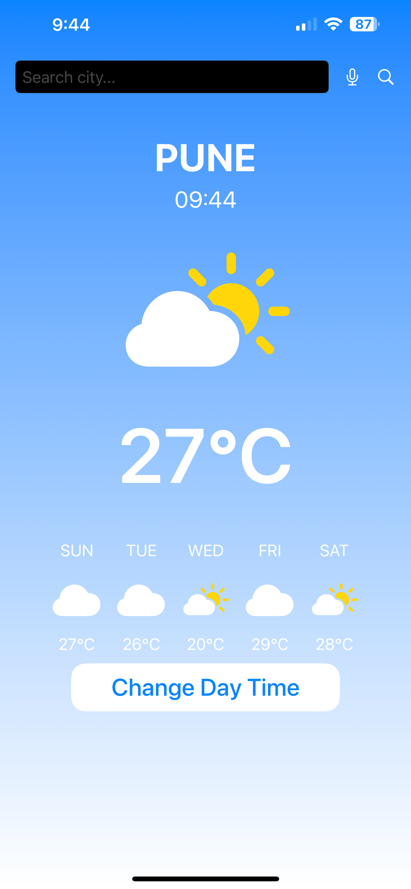
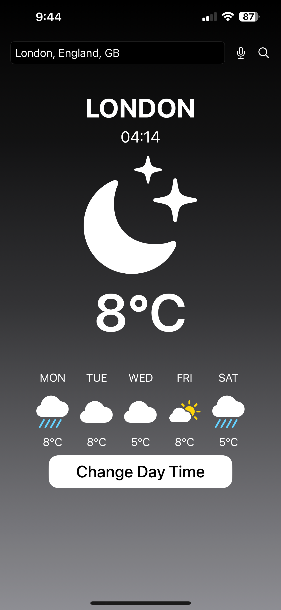

# WeatherAssistant - iOS Weather App

A modern iOS weather application built with SwiftUI that provides real-time weather information with voice search capabilities.

## LIGHT MODE


## DARK MODE



## Features

- **Real-time Weather Data**: Get current weather conditions including temperature and weather status
- **5-Day Forecast**: View weather forecasts for the next 5 days
- **Voice Search**: Search locations using voice commands
- **Location Search**: Auto-complete search suggestions for cities worldwide
- **Dynamic UI**: 
  - Automatic day/night theme based on location's local time
  - Manual theme toggle option
  - Weather-appropriate icons
- **Local Time Display**: Shows the current time at the searched location
- **Accessibility**: VoiceOver support and accessibility labels

## Technical Details

### Built With
- Swift
- SwiftUI
- Combine Framework
- Speech Recognition Framework
- OpenWeatherMap API

### Key Components
- **WeatherViewModel**: Manages weather data and API interactions
- **SpeechRecognizer**: Handles voice input and speech-to-text conversion
- **Location Search**: Geocoding API integration for location suggestions
- **Dynamic Theming**: Automatic theme switching based on local time
- **Async/Await**: Modern concurrency for network calls
- **Error Handling**: Comprehensive error management and user feedback

### APIs Used
- OpenWeatherMap Current Weather Data
- OpenWeatherMap 5-day Forecast
- OpenWeatherMap Geocoding API

## Installation

1. Clone this repository:
   ```bash
   git clone https://github.com/sandy787/WeatherAssistant.git

2. Open WeatherUI.xcodeproj in Xcode

3. Create Config.swift from Config.template.swift and add your API key:
   ```swift
   struct Config {
       static let weatherApiKey = "YOUR_OPENWEATHERMAP_API_KEY"
   }
   ```

4. Build and run the project

## Requirements

- iOS 15.0+
- Xcode 13.0+
- OpenWeatherMap API key

## Usage

1. **Search for a Location**:
   - Type in the search bar
   - Use voice search by tapping the microphone icon
   - Select from auto-complete suggestions

2. **View Weather Information**:
   - Current temperature
   - Weather condition
   - Local time
   - 5-day forecast

3. **Theme Toggle**:
   - Automatic based on local time
   - Manual toggle with "Change Day Time" button

## Privacy Permissions Required

- Microphone access for voice search
- Speech recognition for voice input

## Contributing

1. Fork the repository
2. Create your feature branch (`git checkout -b feature/AmazingFeature`)
3. Commit your changes (`git commit -m 'Add some AmazingFeature'`)
4. Push to the branch (`git push origin feature/AmazingFeature`)
5. Open a Pull Request

## License

This project is licensed under the MIT License - see the [LICENSE.md](LICENSE.md) file for details

## Acknowledgments

- Weather data provided by [OpenWeatherMap](https://openweathermap.org/)
- Icons from SF Symbols
- Speech recognition powered by Apple's Speech Framework

# .gitignore
Config.swift